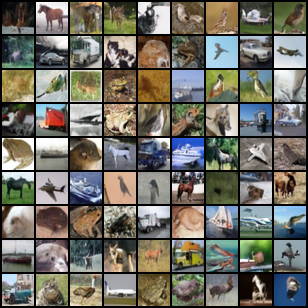

# Denoising Diffusion Probabilistic Models in Jittor
Implementation of the original [Denoising Diffusion Probabilistic Model paper](https://hojonathanho.github.io/diffusion
) in [Jittor, a high-performance deep learning framework based on JIT compiling and meta-operators](https://github.com/Jittor/jittor)

Largely based on and model aligned with <https://github.com/lucidrains/denoising-diffusion-pytorch>

To learn more about how this code works, refer to [The Annotated Diffusion Model](https://huggingface.co/blog/annotated-diffusion)



# Prerequisite
```
pip install jittor
pip install pillow
pip install tqdm
```
# Pretrained models
Available on Baidu drive 
```
通过百度网盘分享的文件：diffusio…
链接:https://pan.baidu.com/s/1oqioEpf8Kid4eKQM-7km9A?pwd=729j 
提取码:729j
复制这段内容打开「百度网盘APP 即可获取」
```
# How to use
With this, you can load, train, and save your diffusion models, as well as generate sample images, compute
fid score, and interpolate between two images.

refer to [train-cifar10.py](./train-cifar10.py) for example and instruction
